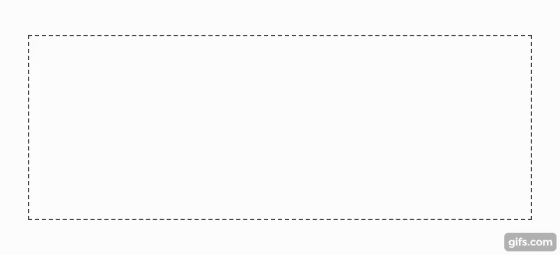
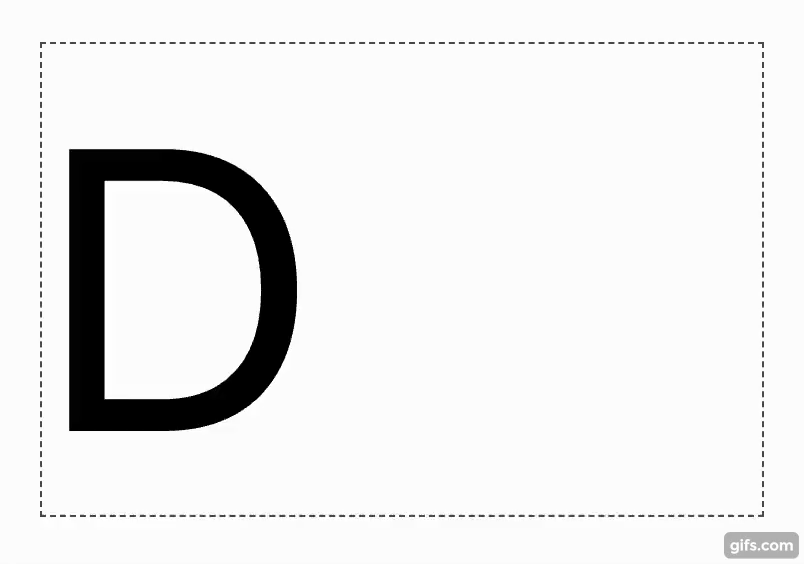

# AutoFit

Automatically adjust the font size of an element so that it fills its container without overflowing. Supports multi-line and single-line.

The algorithm uses computed width and height and therefore works for all fonts types and variations. Not only text, it works for any elements with dimensions defined relative to font size (eg. `width: 1em`).




[**Live demo**](todo:codesandbox)

## React component `AutoFit`

The `AutoFit` component automatically re-runs when `children` changes or when the browser resizes.

```tsx
import { AutoFit } from 'auto-fit'

export const Title = ({ text }) => {
  return (
    <div style={{ maxWidth: '60%', margin: '0 auto' }}>
      <AutoFit>{text}</AutoFit>
    </div>
  )
}
```

### `AutoFit` Props

| Name | Type | Default | Description |
| --- | --- | --- | --- |
| `multiline` | `boolean` | `false` | Allow text to wrap and fit into both container width and height. |
| `ellipsis` | `boolean` | `false` | Show ellipsis (...) if text overflows horizontally due to reaching `minFontSizePx`. |
| `minFontSizePx` | `number` | `8` | The smallest font size the algorithm will use. |
| `maxFontSizePx` | `number` | `200` | The largest font size the algorithm will use. |
| `as` | `string \| ReactComponent` | `'div'` | The underlying component that `AutoFit` will use. |


## Low-level `autoFit` function

The `autoFit` function is used by the `AutoFit` component.

```ts
import { autoFit } from 'auto-fit'

autoFit(options)
```

### `autoFit` options

| Name | Type | Default | Description |
| --- | --- | --- | --- |
| `containerEl` | `HTMLElement` | | The container element is used as bounding box for the inner element. |
| `innerEl` | `HTMLElement` | | The inner element receives the adjusted font size. |
| `ellipsis` | `boolean` | `false` | Show ellipsis (...) if text overflows horizontally due to reaching `minFontSizePx`. |
| `minFontSizePx` | `number` | `8` | The smallest font size the algorithm will use. |
| `maxFontSizePx` | `number` | `200` | The largest font size the algorithm will use. |
